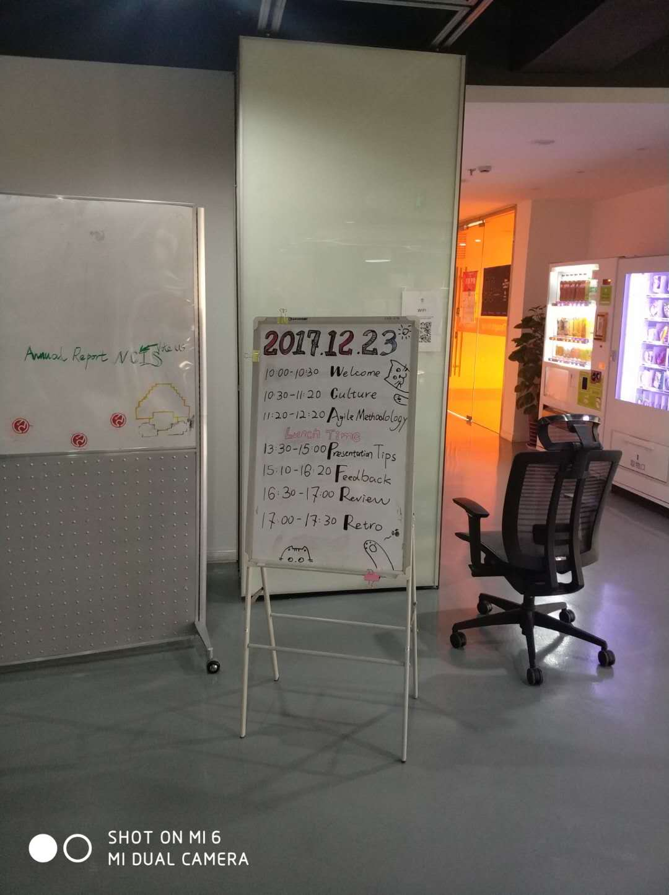
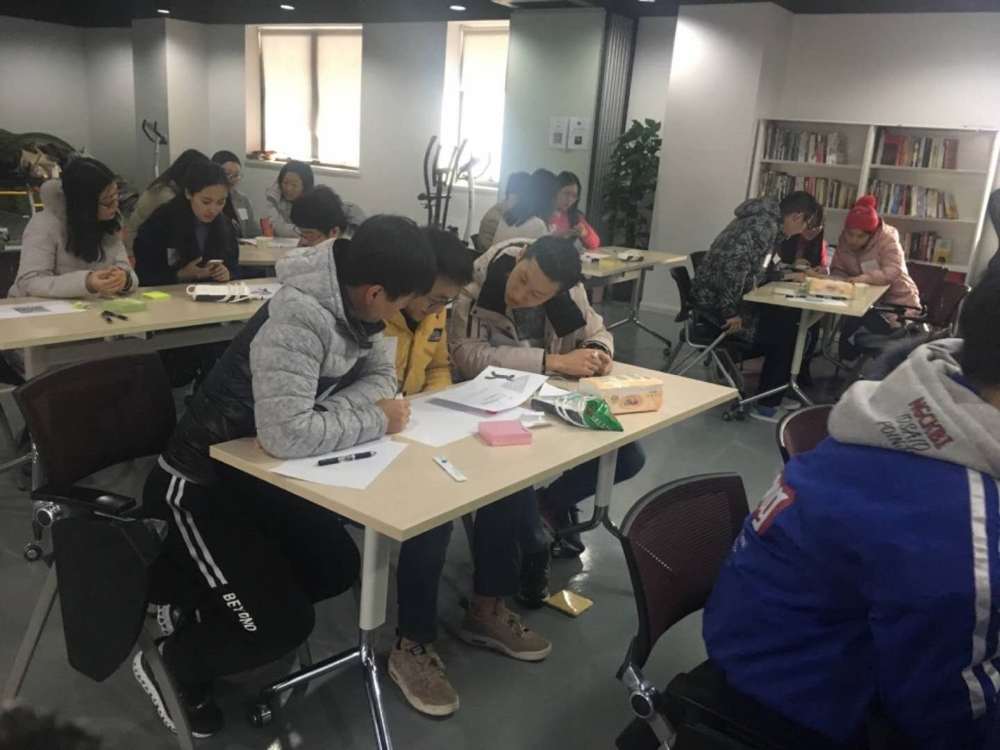
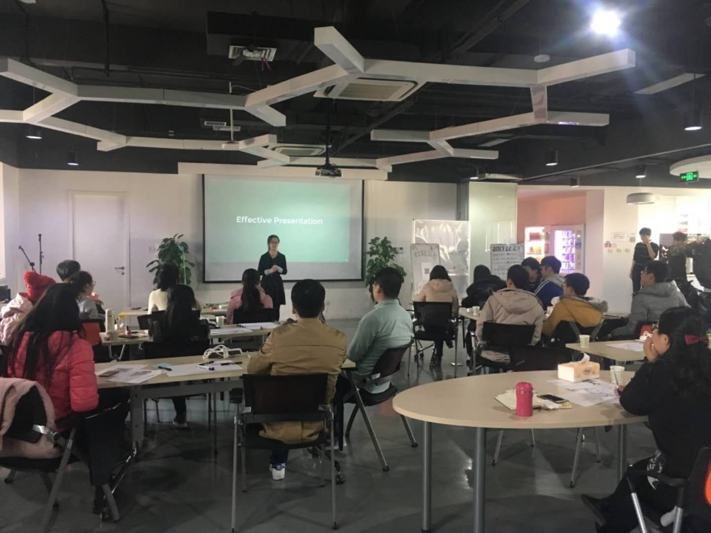
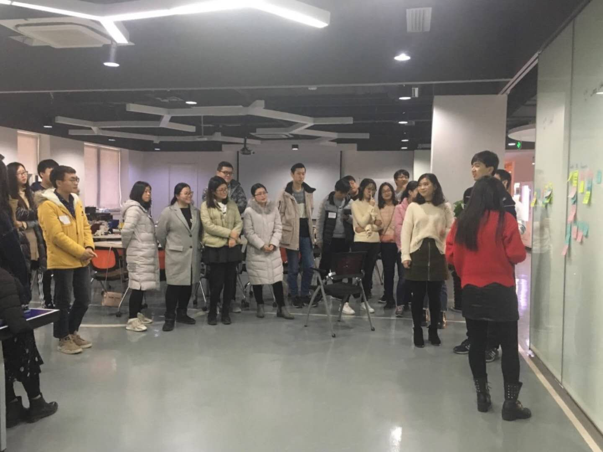

# 思特沃克第一次培训感想

​	第一次来亲自感受一下公司的氛围，感受还是颇多的，其中既包括好奇，又有一点担心，害怕自己无法快速融入思特沃克这个大家庭，但是当正真来到思特沃克的时候这一切的疑虑就都消失的无影无踪了，来到思特沃克丝毫没有感受到任何任何的不适应，因为不管是负责整个活动的志愿者还是给我们上课的老师，还是身边和我一样的小伙伴，大家都是如此的平易近人，大家相处起来特别简单，和这样一群人相处是一件十分愉快的事情，我相信以后在公司的生活将会是十分快乐的！
​	早上当我早早来到公司的时候，已经看到负责活动的志愿者已经把场地的都收拾干净了，而且还贴心的把一整天的活动安排都张贴了出来。

活动一开始的暖场环节也是十分有意思，组织大家玩了一个小游戏，通过做游戏的方式让大家熟悉起来，而不是让每个人都上台做自我介绍，这样既让大家熟悉起来，又避免了一些”尴尬“和冷场的出现（手动点个赞）。接下来就是正式上课时间，首先讲的公司的文化，老师的讲解让我更加深入地了解了公司，了解到思特沃克是一家提倡社会意识、乐趣、客户意识、不妥协精神、企业家精神等价值的公司。

下午的课程一开始就是Presentation Tips，老师的讲解让我收益颇多，通过这一节课程，我学到了一些以前没有关注到的一些东西：

* 在演讲的过程中，要展示自己的激情同时又要和你的听众保持良好的交流，时刻关注你的听众的需求；

* 把演讲尽量做到简洁，要突出重点，分清主次；

* 要把最重要的部分放在演讲的一开始部分；

* 通过讲故事的方式讲述自己的观点更容易让听众接受；

* 准备，准备，准备（重要的事情说三遍）

​	接下来就是Feedback课程，为了让我们更好地理解feedback，在课程开始的时候，老师还和志愿者一起为我们精心准备了一场哑剧表演，表演结束以后老师还让我们分组讨论了一下从表演中我们得到了什么信息，通过这个环节我们了解到了什么是IIY模型和DIE模型。为了让我们更好地理解feedback，老师还让我们分组根据不同的情景现场模拟了一下该如何给出feedback，整个课程十分生动有趣，通过这节课程，我深入地了解到feedback的内涵和重要性。在一整天的课程结束以后，志愿者还组织我们进行了一次回顾，帮助我们回顾今天所学到的知识以及大家可以多提一些意见，共同把下次活动做的更好。

